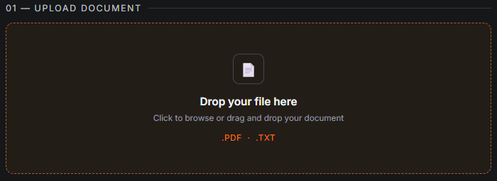
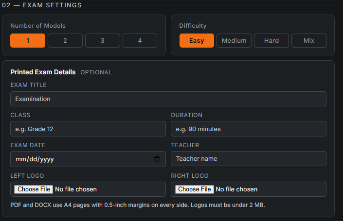
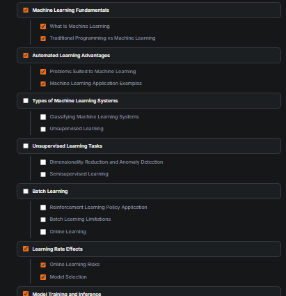
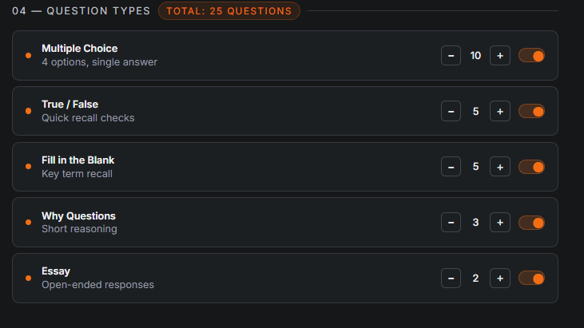
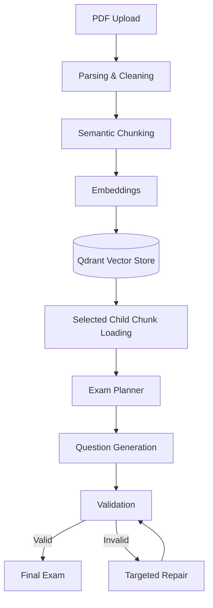

# AI Exam Generator


An AI-powered exam generation system that transforms educational PDF documents into structured, configurable exams.

The system combines document parsing, semantic chunking, embeddings, selected content loading, LLM-based planning, question generation, validation, and targeted repair to keep questions grounded in the selected source material.

## Features

* Upload and process educational PDF documents
* Select specific sections to include in the exam
* Choose exam difficulty
* Generate multiple exam models
* Configure question counts by type
* Supports:

  * Multiple Choice
  * True / False
  * Fill in the Blank
  * Why Questions
  * Essay
* Load only selected child chunks for generation
* Automatically validate generated questions
* Repair only invalid questions instead of regenerating the entire exam

## Application

### 01 — Upload Document

Upload the educational PDF that will be used as the exam source.



### 02 — Exam Settings

Choose the number of exam models and difficulty level.

Available difficulty options:

* Easy
* Medium
* Hard
* Mix



### 03 — Choose Sections

Select the exact document sections that should be included in the exam.

This keeps the generation context focused only on the material selected by the user.



### 04 — Question Types

Configure the number of questions required for each type.



Supported question types include:

| Question Type     | Description                          |
| ----------------- | ------------------------------------ |
| Multiple Choice   | Four options with one correct answer |
| True / False      | Quick factual recall                 |
| Fill in the Blank | Key-term recall                      |
| Why Questions     | Short reasoning questions            |
| Essay             | Open-ended responses                 |


## Sample Generated Exam

Below is a sample exam generated by DraftWork from the **Cambridge International AS and A Level IT Coursebook**.

The generated exam includes:

* Multiple Choice questions
* Fill in the Blank questions with a word bank
* True / False questions
* Short Answer questions
* Essay questions
* A complete teacher answer key

You can view the generated exam in either format:

* [View Generated IT Exam — PDF](output/pdf/exam_exam_430306ff4a9f_matched.pdf)
* [View Generated IT Exam — DOCX](output/docx/exam_exam_430306ff4a9f_matched.docx)

### Source Material

The sample exam was generated from:

**Paul Long, Sarah Lawrey, and Victoria Ellis. _Cambridge International AS and A Level IT Coursebook_. Cambridge University Press, 2016. ISBN: 978-1-107-57724-4.**

The source textbook is used only as input material to demonstrate DraftWork's document-processing and exam-generation workflow. The textbook itself is not included in this repository.
## Architecture



## Validation & Repair

Generated questions are validated before they are accepted as final output.

The validator checks for issues such as:

* unclear or malformed questions
* duplicate MCQ options
* multiple potentially correct answers
* missing or incorrect answers
* invalid question structure
* Fill-in-the-Blank answer and word-bank inconsistencies

Each question receives a stable ID generated by the application.

Example:

```text id="p9u964"
model1_mcq_1
model1_true_false_1
model1_fill_in_the_blank_1
```

If a question fails validation, the system repairs only that question instead of regenerating the whole exam.

```text id="4igx1e"
Generate
   ↓
Validate
   ↓
PASS ───────→ Final Exam
   ↓
FIX
   ↓
Repair Invalid Question
   ↓
Revalidate
```

This keeps already-valid questions unchanged and reduces unnecessary LLM regeneration.

## Tech Stack

| Component              | Technology                   |
| ---------------------- | ---------------------------- |
| Language               | Python                       |
| Backend API            | FastAPI                      |
| Workflow Orchestration | LangGraph                    |
| Embeddings             | FlagEmbedding / Transformers |
| Vector Database        | Qdrant                       |
| ML Runtime             | PyTorch                      |
| PDF Parsing            | LlamaParse                   |
| Validation             | Pydantic + custom validation |
| NLP                    | spaCy                        |
| Testing                | Pytest                       |
| Frontend               | HTML / JavaScript            |

## Setup

Clone the repository:

```bash id="w6fc3n"
git clone https://github.com/AbdelrahmanAlabadla/DraftWork.git
cd DraftWork
```

Create a virtual environment:

```bash id="54mvaa"
python -m venv .venv
```

Activate it on Windows:

```bash id="ec7xpl"
.venv\Scripts\activate
```

Install dependencies:

```bash id="6h31ob"
pip install -r requirements.txt
```

Create a `.env` file from `.env.example` and configure the required model and API settings.

Start Qdrant:

```bash id="mjzm19"
docker run -p 6333:6333 qdrant/qdrant
```

Run the application:

```bash id="fb7ho3"
python run.py
```

## Tests

Run the test suite with:

```bash id="mu4ygr"
pytest -q
```

The tests cover core components including:

* document processing
* semantic chunking
* selected content loading
* exam generation
* validation and repair
* API behavior

## Author

**Abdelrahman Alabadla**

AI / Software Engineer
