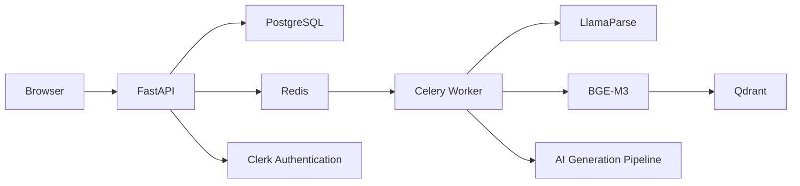

# DraftWork

DraftWork is an AI-powered exam generator that turns educational documents into structured, ready-to-use exams.

Upload a PDF or text document, choose the sections you want to use, select the difficulty and question types, and generate one or more exam models with answer keys.

Instead of relying on one large AI prompt, DraftWork combines document retrieval with a multi-stage generation pipeline in which every stage has a focused responsibility.

## Product Preview


## What You Can Do

* Upload educational PDF or text documents
* Choose which sections should be included in the exam
* Select Easy, Medium, Hard, or mixed difficulty
* Choose the number and type of questions
* Generate multiple exam models
* Generate MCQ, Fill-in-the-Blank, True/False, Definition, Why, Equation, Word Problem, and Essay questions
* Generate answer keys automatically
* Preview exams before downloading
* Export exams as PDF or DOCX
* Use DraftWork without creating an account
* Save exams and reopen them later after signing in

## How DraftWork Works

1. Upload an educational document.
2. DraftWork processes and organizes its content.
3. Choose the sections you want to include.
4. Select the difficulty, question types, and number of questions.
5. DraftWork retrieves content relevant to the selected sections.
6. The AI pipeline plans, generates, validates, and repairs the questions.
7. Review the final exam and answer key.
8. Export the result as PDF or DOCX.

## Workflow Screenshots

### Configure the Exam


### Select the Content


### Choose Question Types


## Multi-Stage AI Generation

Exam generation is divided into focused stages rather than handled by one large model request:

* **Planner** decides which concepts should be covered and creates the exam structure.
* **Generator** creates questions from the plan and the relevant retrieved content.
* **Validator** checks question clarity, structure, correctness, and answer validity.
* **Repairer** fixes only the questions that fail validation instead of regenerating the entire exam.

```text
Selected Content
      ↓
    Planner
      ↓
   Generator
      ↓
   Validator
      ↓
 Valid? ── Yes ──→ Final Exam
      │
      No
      ↓
   Repairer
      ↓
 Revalidation
      ↓
  Final Exam
```

This structure gives every stage a smaller responsibility and allows valid questions to remain unchanged when another question needs repair.

## Document Retrieval

DraftWork does not repeatedly send the complete uploaded document to the language model.

Documents are parsed with **LlamaParse**, cleaned, and divided into meaningful sections. **BGE-M3** creates dense and sparse embeddings, while **Qdrant** stores the vectors and performs hybrid retrieval.

When an exam is generated, DraftWork retrieves content relevant to the sections selected by the user. This keeps the generation process focused on the source material that should appear in the exam.

## Accounts and Saved Exams

Creating an account is optional. Users can upload documents and generate exams anonymously.

If they sign in later, their current session and generated exams are linked to their account instead of being lost. Authentication is handled through **Clerk**, with support for Google and email/password sign-in.

After signing in, the profile menu provides:

* **Manage account**
* **My Exams**
* **Sign out**

**My Exams** opens directly inside the generator. Saved exams can be reopened in the existing Exam Preview and exported again as PDF or DOCX. They remain attached to the account across sessions and devices.

The frontend sends the active Clerk session token to FastAPI through the `Authorization` header. Authentication tokens are not stored in PostgreSQL, `localStorage`, or `sessionStorage`.

Signing out keeps the user's saved exams attached to their account and starts a new anonymous DraftWork session in the browser.

## Built for Multiple Users

A major part of preparing DraftWork for deployment was making sure different users could use the application without their data being mixed together.

The backend enforces ownership for:

* Uploaded documents
* Processing and generation jobs
* Generated exams
* Exports
* Retrieved document data

Long-running document processing and exam generation run as background jobs instead of blocking the main API. DraftWork uses **FastAPI**, **PostgreSQL**, **Celery**, **Redis**, **Qdrant**, **Clerk**, and **Docker** to support this workflow.

## About the Project

DraftWork started as a project I built while studying Computer Science.

The first idea was simple: upload educational material and use AI to generate an exam from it. As I kept building, the project grew to include document processing, retrieval, structured generation, validation and repair, background jobs, persistent storage, authentication, user isolation, saved exams, and exports.

A big part of this project has been learning what it takes to move from an AI prototype that works locally to an application that can actually be used by different people.

## Project Status

The main DraftWork workflow works end to end:

```text
Upload
→ Process
→ Select Sections
→ Configure Exam
→ Retrieve Content
→ Plan
→ Generate
→ Validate / Repair
→ Preview
→ Export
```

Persistent storage, background jobs, authentication, saved exams, account ownership, multi-user isolation, monitoring, and cleanup are also implemented as part of preparing DraftWork for deployment.

There are still final deployment and real-world usage checks to complete, but DraftWork is getting close to its first public online release.

## Architecture



FastAPI serves the frontend and API. PostgreSQL stores application and account data, Redis and Celery manage background work, and Qdrant stores document vectors used during retrieval. Clerk provides authentication while DraftWork keeps application ownership rules in its own database.

## Testing

DraftWork includes automated tests for document processing, retrieval, API validation, idempotency, background jobs, generation timeouts, authentication, session claiming, account ownership, saved exams, exports, cleanup, migrations, and monitoring.

The project also records generation and validation results so exam quality can be reviewed across models and question types.


